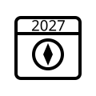

# Geospatial Conferences 2027

This repository contains the list of geospatial conferences for 2027. 
For links to conference lists from other years, see [the main **Geospatial Conferences** repository](https://github.com/nowosad/geospatial-conferences). 

> Contributions are welcome -- please open a pull request if you would like to add or update a conference.

*Unless otherwise noted, conferences are in English.*

## Asia

## Europe

  <!-- - **(German)** 17. Geofachtag des Netzwerk GIS Sachsen-Anhalt e. V, Dessau, 18 February 2026 -->
  - The 30th AGILE Conference, https://agile-gi.eu/, Lund, 21--24 June 2026
  - Machine Learning for Earth Observation Conference, https://ml4eo.org/, Exter, 14--16 June 2027
  - 33rd International Cartographic Conference, https://icc2027.org/, Warsaw, 18-23 July 2027

## North America

## Oceania

## South America

## Similar lists

- [List of selected events (conferences, workshops, etc.) related to forest sciences, geospatial analysis, cartography, remote sensing by Jens Wiesehahn](https://github.com/wiesehahn/conferences)
- [OsmCal](https://osmcal.org/), a list of events and meetups for local and international OpenStreetMap contributors/users
- [GeoAwesome](https://geoawesome.com/events/), a list of events in the field of geospatial technologies,
- [OSGeo events](https://www.osgeo.org/events/), various events organized by open source geospatial developments communities
- [Geomob events](https://thegeomob.com/events)
